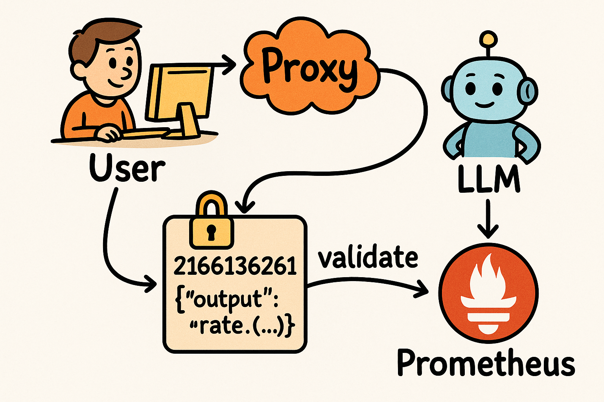
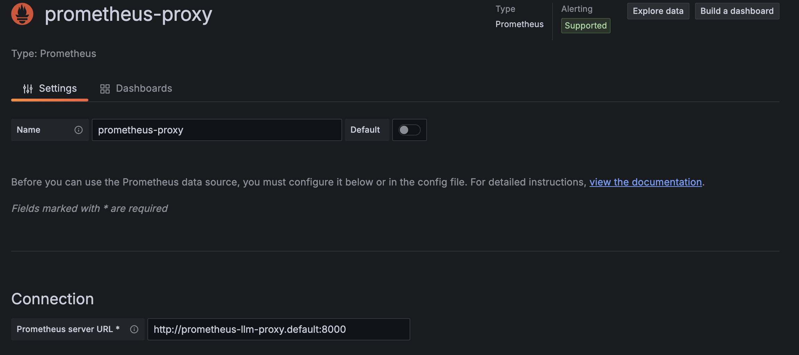
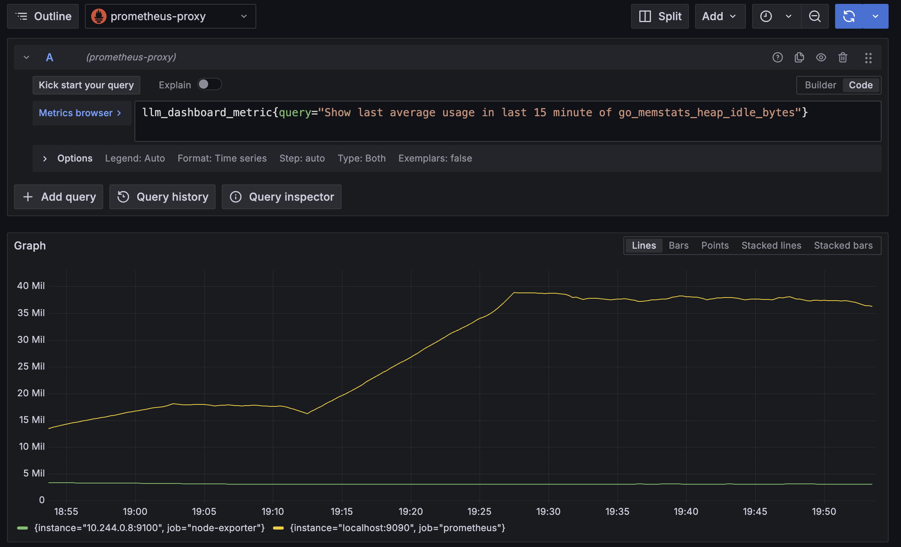

# prometheus-llm-proxy
**Prometheus-LLM-Proxy ** is a proxy on top of the Prometheus data sources in Grafana side.

It basically fetch your query requirements then let you discover the exact query by the iterations.
Prometheus proxy that enables SREs and engineers to search and explore metrics using natural language instead of manually writing PromQL queries.

## 🚀 Features
- **Natural Language to PromQL** – Ask questions like _"show Prometheus server uptime"_ and get a valid query instantly.
- **Query Caching** – Approved queries are stored in memory and executed directly without invoking the LLM again.
- **SRE-Friendly** – Makes finding metrics faster, even if you don't remember the exact metric names or labels.
- **Prometheus Integration** – Full compatibility with `/api/v1/query` and `/api/v1/query_range` endpoints.
- **Human-in-the-Loop** – Query approval flow ensures correctness before caching.

Here is the sample diagram for end user

</img>

## Integration and Usage 

## Integration with Grafana

Basically you can add `prometheus-llm-proxy` as a Prometheus data source in Grafana like this;

</img>

Then you can jump into the Explore section and try to discover exact query what you need.

</img>

## Usage & Installation

## Helm based installation

This project have very simple helm chart. It basically use couple of fundamental environment variables like this;

```yaml
secrets:
  open_ai_key: ""
  prometheus_address: "http://prometheus.monitoring:9090"
  llm_endpoint: "https://api.openai.com/v1/responses"
```

This secret options allows you to manage it with your local LLM providers like **OLLAMA** but it prefer OpenAI as a default.

Here is the sample helm based installation steps like this;

```sh
$ git clone github.com/WoodProgrammer/prometheus-llm-proxy.git
$ pushd prometheus-llm-proxy/deploy/k8s
$ helm upgrade -i prometheus-llm-proxy -f values.yaml -n monitoring
$ popd
```

⚙️ How It Works

* User Action – In Grafana, the user writes a natural language request (e.g., "show average CPU usage per node in the last 1h").

* Query Translation – The plugin sends this request to the LLM engine.

* Query Validation – The generated PromQL is parsed, linted, and checked for performance constraints.

## Execution –

If the query has been approved before, it is fetched from the memory store and executed directly.
Otherwise, it is sent to Prometheus for results.
Approval & Caching – Once approved by the user, the query is stored in memory for future reuse.


# API

This proxy provide you to manage and filter your queries by the API to prevent waste the LLM resources. Here is the sample usage like this;

| Endpoint    | Method       | Description   |
| -------- | -------       | ------- |
| /api/v1/validate_query  | POST          |    You can validate your queries by the hash with a simple POST request     |

* Sample usage;
```sh
curl -XPOST localhost:8000/api/v1/validate_query -d '{"hash":"658843486", "status": true}'
```


| Endpoint    | Method       | Description   |
| -------- | -------       | ------- |
| /api/v1/get_all_queries  | GET          |    This endpoint let you to fetch all the queries     |

* Sample usage;
```sh
curl -XGET localhost:8000/api/v1/get_all_queries -d '{"hash":"658843486", "status": true}'
```

### Notice 
The hashes generating by the prompt of the users. This approach allows us to manage all the prompt by the hash. If a query validate by a user the proxy stop to ask the prompt to LLM provider.

# FUTURE Improvements

* Fix the minor bugs in Grafana integration
* Persistency solution for hash maps
* Prompt options
* Make the code lean!


👨‍💻 Author
WoodProgrammer
💼 SRE & Golang Developer
📧 emirozbirdeveloper@gmail.com